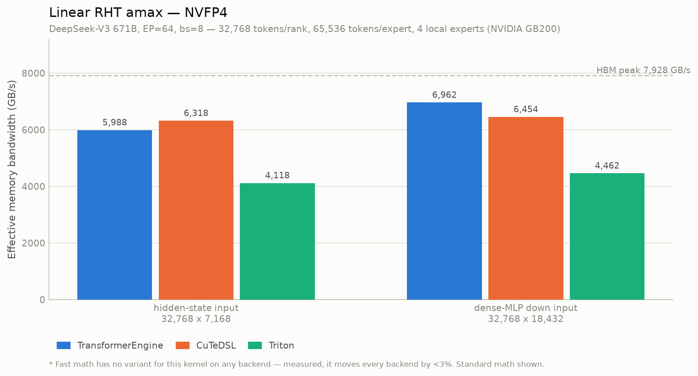
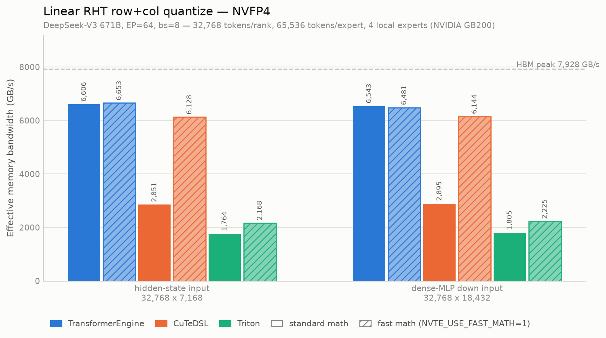
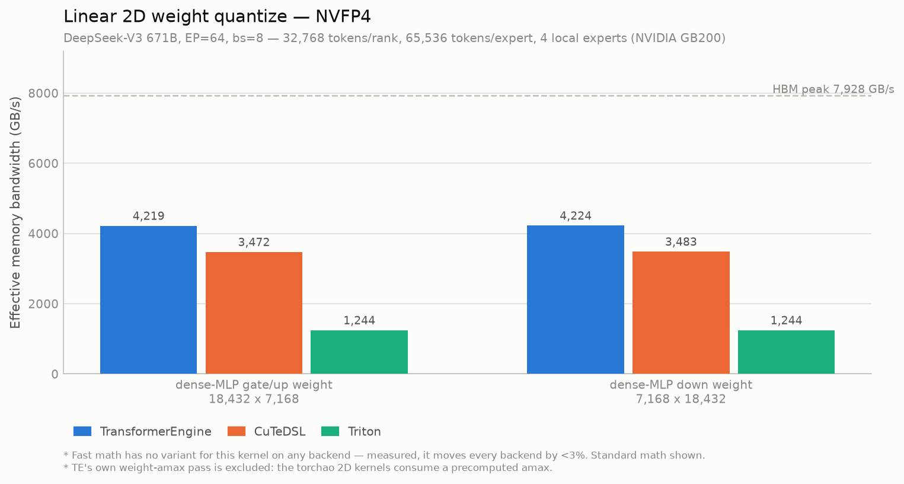
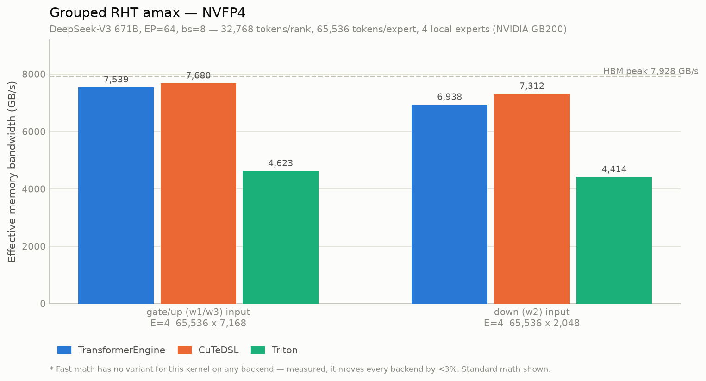
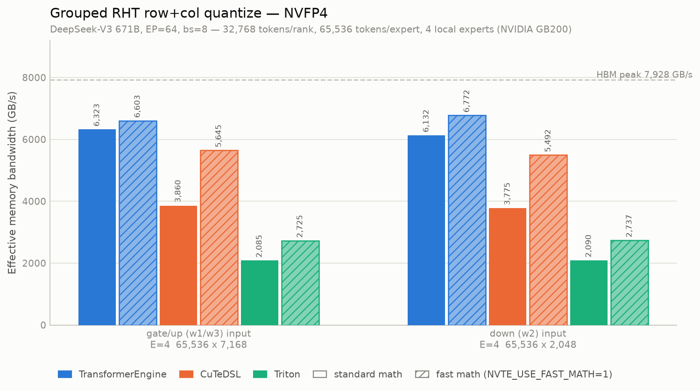
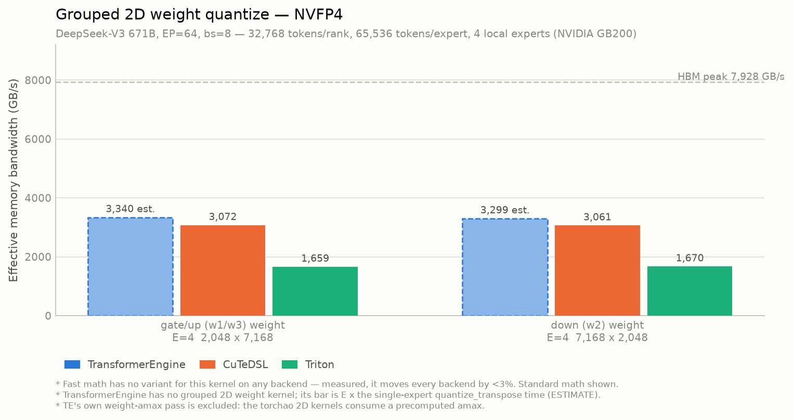
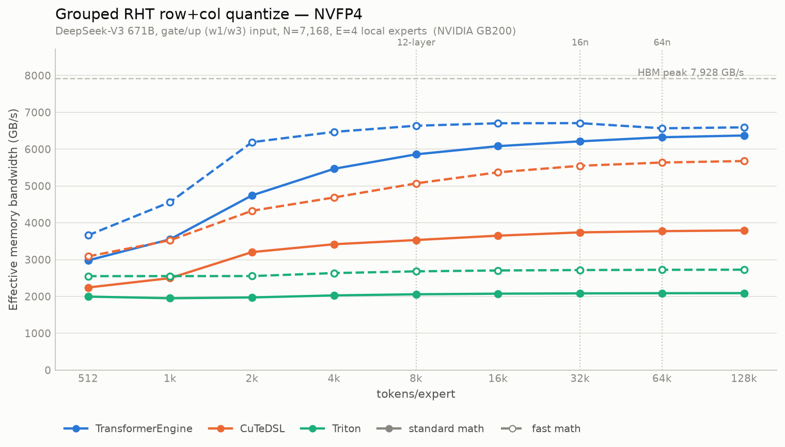
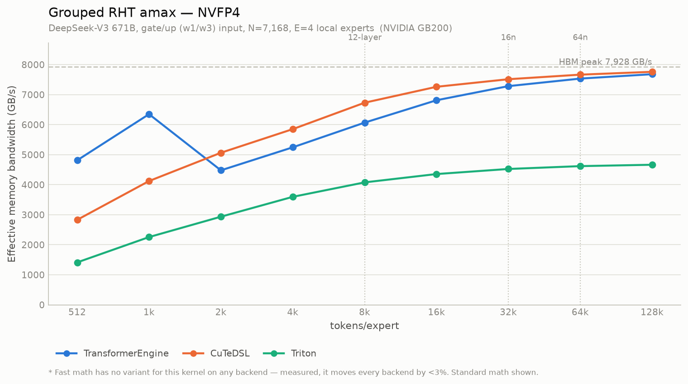

# NVFP4 kernel bandwidth at DeepSeek-V3 671B, EP=64

Effective memory bandwidth of all six NVFP4 training kernels across
**TransformerEngine**, **CuTeDSL** and **Triton**, at **standard** and **fast** math, on
a single **NVIDIA GB200** (peak HBM 7,928 GB/s).

Environment: CUDA 13.4, TransformerEngine 2.19.0.dev0+172bd93, nvidia-cutlass-dsl 4.5.2,
torchao @ `nvfp4_moe_cutedsl`. Times are CUDA kernel self-time, 15 warmups / 50 measured
iterations, memcpy and memset excluded.

## Layout

```
671B: 256 routed experts, top-k 8, seq 4096, dim 7168, moe_hidden_dim 2048
bs 8 / ep 64  ->  tokens/rank   = 8 * 4096                  = 32,768
                  local experts = 256 / 64                  = 4
                  tokens/expert = (8 * 4096 * 64 * 8) / 256 = 65,536   (balanced, 0% slack)
```

Activation shapes drive the amax and 1D quantize charts; weight shapes drive the 2D
charts (weights do not scale with the token count — only `E = 4` comes from EP=64).

## Headline

1. **Fast math is the single biggest lever on CuTeDSL, and only on the 1D quantize
   kernels.** It is worth **2.15x** on the linear path (2,851 → 6,128 GB/s) and 1.46x
   grouped, taking CuTeDSL from ~2.3x behind TransformerEngine to within 8% of it. On the
   other four kernels it does nothing at all.
2. **TE leads every kernel except the two amax kernels**, where CuTeDSL edges ahead
   (grouped gate/up: 7,680 vs 7,539 GB/s, 97% of peak).
3. **Triton trails everywhere**, 1.5–2.3x behind CuTeDSL, and its fast-math gain is much
   smaller (1.23x linear vs CuTeDSL's 2.15x).
4. **The amax kernels are the closest to hardware peak** (92–97%); the 2D weight kernels
   are the furthest (42–53%) and are the clearest remaining headroom.

## 1. Linear RHT amax



| shape | M x N | TE us | CuTeDSL us | Triton us | TE GB/s | CuTeDSL GB/s | Triton GB/s | best % peak |
|---|---|---:|---:|---:|---:|---:|---:|---:|
| hidden-state input | 32,768 x 7,168 | 78.45 | **74.36** | 114.06 | 5,988 | **6,318** | 4,118 | 79.7 |
| dense-MLP down input | 32,768 x 18,432 | **173.51** | 187.18 | 270.74 | **6,962** | 6,454 | 4,462 | 87.8 |

## 2. Linear RHT row+col quantize



| shape | M x N | math | TE us | CuTeDSL us | Triton us | TE GB/s | CuTeDSL GB/s | Triton GB/s |
|---|---|---|---:|---:|---:|---:|---:|---:|
| hidden-state input | 32,768 x 7,168 | standard | **111.11** | 257.43 | 416.03 | **6,606** | 2,851 | 1,764 |
| hidden-state input | 32,768 x 7,168 | fast | **110.32** | 119.78 | 338.52 | **6,653** | 6,128 | 2,168 |
| dense-MLP down input | 32,768 x 18,432 | standard | **288.47** | 651.95 | 1,045.69 | **6,543** | 2,895 | 1,805 |
| dense-MLP down input | 32,768 x 18,432 | fast | **291.24** | 307.19 | 848.29 | 6,481 | 6,144 | 2,225 |

Fast-math speedup: CuTeDSL **2.15x / 2.12x**, Triton 1.23x, TE 1.01x / 0.99x.

## 3. Linear 2D weight quantize



| shape | M x N | TE us | CuTeDSL us | Triton us | TE GB/s | CuTeDSL GB/s | Triton GB/s | best % peak |
|---|---|---:|---:|---:|---:|---:|---:|---:|
| dense-MLP gate/up weight | 18,432 x 7,168 | **97.87** | 118.92 | 331.91 | **4,219** | 3,472 | 1,244 | 53.2 |
| dense-MLP down weight | 7,168 x 18,432 | **97.74** | 118.55 | 331.84 | **4,224** | 3,483 | 1,244 | 53.3 |

## 4. Grouped RHT amax



| shape | E | M x N | TE us | CuTeDSL us | Triton us | TE GB/s | CuTeDSL GB/s | Triton GB/s | best % peak |
|---|---:|---|---:|---:|---:|---:|---:|---:|---:|
| gate/up (w1/w3) input | 4 | 65,536 x 7,168 | 498.46 | **489.33** | 812.86 | 7,539 | **7,680** | 4,623 | 96.9 |
| down (w2) input | 4 | 65,536 x 2,048 | 154.75 | **146.84** | 243.25 | 6,939 | **7,312** | 4,414 | 92.2 |

The only kernel family where CuTeDSL beats TransformerEngine outright.

## 5. Grouped RHT row+col quantize



| shape | E | M x N | math | TE us | CuTeDSL us | Triton us | TE GB/s | CuTeDSL GB/s | Triton GB/s |
|---|---:|---|---|---:|---:|---:|---:|---:|---:|
| gate/up (w1/w3) input | 4 | 65,536 x 7,168 | standard | **928.73** | 1,521.30 | 2,816.14 | **6,323** | 3,860 | 2,085 |
| gate/up (w1/w3) input | 4 | 65,536 x 7,168 | fast | **889.35** | 1,040.15 | 2,154.79 | **6,603** | 5,645 | 2,725 |
| down (w2) input | 4 | 65,536 x 2,048 | standard | **273.58** | 444.45 | 802.56 | **6,132** | 3,775 | 2,091 |
| down (w2) input | 4 | 65,536 x 2,048 | fast | **247.73** | 305.51 | 612.95 | **6,772** | 5,492 | 2,737 |

Fast-math speedup: CuTeDSL **1.46x**, Triton 1.31x, TE 1.04x / 1.10x.

## 6. Grouped 2D weight quantize



| shape | E | M x N | TE us (est.) | CuTeDSL us | Triton us | TE GB/s | CuTeDSL GB/s | Triton GB/s | best % peak |
|---|---:|---|---:|---:|---:|---:|---:|---:|---:|
| gate/up (w1/w3) weight | 4 | 2,048 x 7,168 | *54.94* | **59.74** | 110.64 | *3,340* | **3,072** | 1,659 | 42.1 |
| down (w2) weight | 4 | 7,168 x 2,048 | *55.62* | **59.95** | 109.87 | *3,299* | **3,061** | 1,670 | 41.6 |

**TransformerEngine has no grouped 2D weight kernel.** Its column is `E x` the
single-expert `quantize_transpose_nvfp4_2D_kernel` time — an estimate, drawn as an open
dashed bar in the chart. It is also optimistic: it charges nothing for the four separate
launches a real per-expert loop would pay.

## Token sweep

The six charts above put *shape* on the x-axis, which is a label rather than a scale:
two shapes can differ in both M and N, so no ordering of them carries physical meaning.
The sweep below puts a scalar that actually drives the kernel on x instead — the token
count — at a fixed model hidden dim N. That is apples-to-apples by construction: N is a
model constant, and the token count is exactly what the parallel layout varies. The three
cells of the 671B EP grid become three annotated points on one curve:

| layout | bs / ep | tokens/rank | tokens/expert |
|---|---|---:|---:|
| 671B 12-layer | 4 / 16 | 16,384 | 8,192 |
| 671B 16n | 8 / 32 | 32,768 | 32,768 |
| 671B 64n | 8 / 64 | 32,768 | 65,536 |

Only the four token-dependent kernels are swept — the 2D weight kernels quantize expert
weights and have no token dependence at all.

| | N = 7,168 | second N |
|---|---|---|
| Linear amax | [chart](nvfp4_671b_sweep_linear_amax_n7168.png) | [N=18,432](nvfp4_671b_sweep_linear_amax_n18432.png) |
| Linear 1D quantize | [chart](nvfp4_671b_sweep_linear_quantize_1d_n7168.png) | [N=18,432](nvfp4_671b_sweep_linear_quantize_1d_n18432.png) |
| Grouped amax | [chart](nvfp4_671b_sweep_grouped_amax_n7168.png) | [N=2,048](nvfp4_671b_sweep_grouped_amax_n2048.png) |
| Grouped 1D quantize | [chart](nvfp4_671b_sweep_grouped_quantize_1d_n7168.png) | [N=2,048](nvfp4_671b_sweep_grouped_quantize_1d_n2048.png) |




### What the sweep shows that the bars cannot

1. **All three deployment cells sit past the knee.** At 8k / 32k / 64k tokens every
   quantize kernel is within a few percent of its asymptote, so the ranking at the
   operating points *is* the asymptotic ranking — small-batch behaviour does not matter
   for these layouts. Only the amax kernels are still climbing there.

2. **CuTeDSL's standard-math 1D quantize never becomes bandwidth-bound.** It plateaus at
   ~2,900 GB/s linear and ~3,800 grouped *regardless of size*, while its fast path
   reaches 5,854 / 5,678 on the same shapes. Fast math is not merely faster here — it
   changes what limits the kernel. A flat curve well below peak is the signature of an
   instruction-bound kernel, and no batch size will fix it.

3. **Triton's grouped quantize at N=7,168 is flat from the smallest size measured** —
   1,996 GB/s at 512 tokens/expert, 2,090 at 131,072, a 1.05x ramp across a 256x size
   range. It is hard instruction-bound at 26% of peak.

4. **The amax kernels have not saturated even at 131,072 tokens.** CuTeDSL's grouped amax
   reaches 7,761 GB/s there — 98% of peak, the closest anything in this study gets to the
   hardware.

5. **CuTeDSL overtakes TE on grouped amax between 1k and 2k tokens/expert** and stays
   ahead from there. This is the one real crossover in the data; every other ranking is
   stable across the whole sweep. TE's grouped amax also shows a reproducible
   discontinuity at 1k tokens/expert (6,349 GB/s, dropping to 4,483 at 2k) — a tile /
   occupancy artifact, well below any deployment point.

Sweep data: [`nvfp4_671b_token_sweep.csv`](nvfp4_671b_token_sweep.csv) (432 rows), from
`nvfp4_671b_token_sweep.py`. One TE profile per size feeds both that family's charts,
since TE fuses amax and quantize into a single call.

## Methodology

### TE per-kernel attribution

TransformerEngine exposes no standalone amax or quantize entry point — `NVFP4Quantizer`
and `tex.split_quantize` fuse them into one call, and a 2D weight call launches three
kernels. TE's per-kernel numbers are therefore attributed from the profiler by CUDA
kernel name. `nvfp4_671b_te_kernel_probe.py` fixes that mapping and reproduces the
torchao benchmark README's published TE breakdown, which validates the method:

| TE call | kernel | chart | probe | README |
|---|---|---|---:|---:|
| linear | `HadamardAmaxTmaKernel` + `ZeroAmaxKernel` | 1 | 6.08 | 4.47 (excl. zero) |
| linear | `row_col_rht_gemm_device` | 2 | 12.95 | 12.98 |
| grouped | `GroupHadamardAmaxTmaKernel` + `MultiZeroAmaxKernel` | 4 | 25.97 | 25.81 |
| grouped | `group_row_col_rht_gemm_device` | 5 | 37.93 | 38.32 |
| 2D weight | `quantize_transpose_nvfp4_2D_kernel` | 3, 6 | 13.76 | 13.80 |
| 2D weight | `amax_kernel` + `zero_amax_kernel` | *excluded* | 6.92 | 5.40 + 1.34 |

(at the README's `(2048, 7168)` / `E=4 x 2048 x 7168` shapes, standard math)

The classifier in `nvfp4_671b_kernel_bandwidth.py` raises on any unclassified kernel, so
a TE update that renames or adds one fails loudly rather than silently dropping time.

**TE's own weight-amax pass is excluded from charts 3 and 6.** The torchao 2D kernels
consume a *precomputed* amax; counting TE's amax pass would credit them with skipping a
pass they never run. Same call the torchao README makes.

### Fair-comparison notes

- Charts 2 and 5 feed every backend the **same precomputed amaxes**, so the amax kernel
  sits outside every timed region.
- RTNE only. Stochastic rounding is a separate axis, out of scope here.
- Bytes moved: `elements * 2` for amax (bf16 read, negligible scalar output);
  `elements * 2 + elements + 2 * elements/16` for the quantize kernels (bf16 read +
  rowwise/colwise FP4 codes + both e4m3 block-scale sets) — the same accounting the
  torchao `bench_*` scripts use, so these GB/s are comparable with that README's.

### Fast math

`NVTE_USE_FAST_MATH=1` for TE; `use_fast_math=True` for Triton and CuTeDSL. It applies to
**two of the six kernels**:

| kernel | fast math |
|---|---|
| 1, 4 (amax) | No variant on any backend — the amax kernels are always exact. |
| 2, 5 (1D quantize) | Yes, all three backends. |
| 3, 6 (2D weight) | No path on any backend. Structural: no RHT means no accumulator round-through to skip, and CuTeDSL's 2D wrapper asserts `not (fast_math and not apply_rht)`. |

Both modes were measured on all six kernels regardless; the four flat ones moved every
backend by **<3%**, so the plotter drops their fast series rather than drawing three
identical-height pairs. That threshold is applied to the data, not hardcoded per chart.

## Reproducing

```bash
cd third_party/torchao

# Optional: re-confirm the TE kernel-name mapping.
PYTHONPATH=. python ../../deepseek_v3/kernel_analysis/nvfp4_671b_te_kernel_probe.py

# Collect (needs a GB200 / SM100+).
PYTHONPATH=. python ../../deepseek_v3/kernel_analysis/nvfp4_671b_kernel_bandwidth.py \
    --chart all --csv ../../deepseek_v3/kernel_analysis/nvfp4_671b_64n_bandwidth.csv

# Token sweep (~25 min; the largest points allocate several GB per backend).
PYTHONPATH=. python ../../deepseek_v3/kernel_analysis/nvfp4_671b_token_sweep.py \
    --csv ../../deepseek_v3/kernel_analysis/nvfp4_671b_token_sweep.csv

# Plot (no GPU needed).
cd ../.. && python deepseek_v3/kernel_analysis/plot_nvfp4_671b_kernel_bandwidth.py \
    && python deepseek_v3/kernel_analysis/plot_nvfp4_671b_token_sweep.py
```

`PYTHONPATH=.` from the submodule root is required, not cosmetic: site-packages holds a
stale non-editable torchao 0.19.0 copy missing the grouped kernels. It also puts the
submodule's `benchmarks` package on the path, so `bench_utils.kernel_time_us` is reused
rather than reimplemented.

Raw data: [`nvfp4_671b_64n_bandwidth.csv`](nvfp4_671b_64n_bandwidth.csv) (72 rows).
